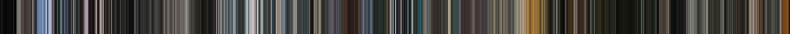

# Colour of Film

Create colour profiles of any film.



A colour profile is constructed by taking each frame in the film,
determining the average colour of that frame and painting a 1 pixel
wide stripe into the output image.  The result is an image equal in
width to the number of frames in the video* that shows a profile of
the average colour of the video over time.

*Due to the large number of frames in most video, `colour-of-film`
defaults to processing key frames only, this can be overridden with
the `--all-frames` flag.

## Usage

```
colour-of-film input-video.mp4 -o output-image.png
```

The height of the output image can be set with `-h <pixels>`

To see all supported options and defaults:
```
colour-of-film --help
```

## License

Copyright 2021 Nick Ogden

Licensed under the Apache License, Version 2.0 (the "License");
you may not use this file except in compliance with the License.
You may obtain a copy of the License at

http://www.apache.org/licenses/LICENSE-2.0

Unless required by applicable law or agreed to in writing, software
distributed under the License is distributed on an "AS IS" BASIS,
WITHOUT WARRANTIES OR CONDITIONS OF ANY KIND, either express or
implied.  See the License for the specific language governing
permissions and limitations under the License.
